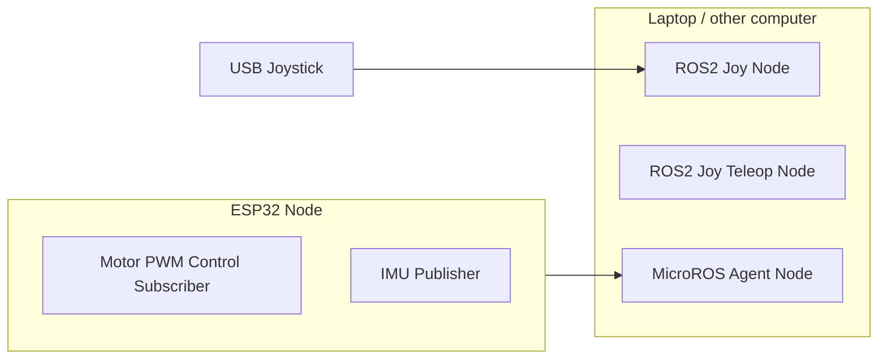
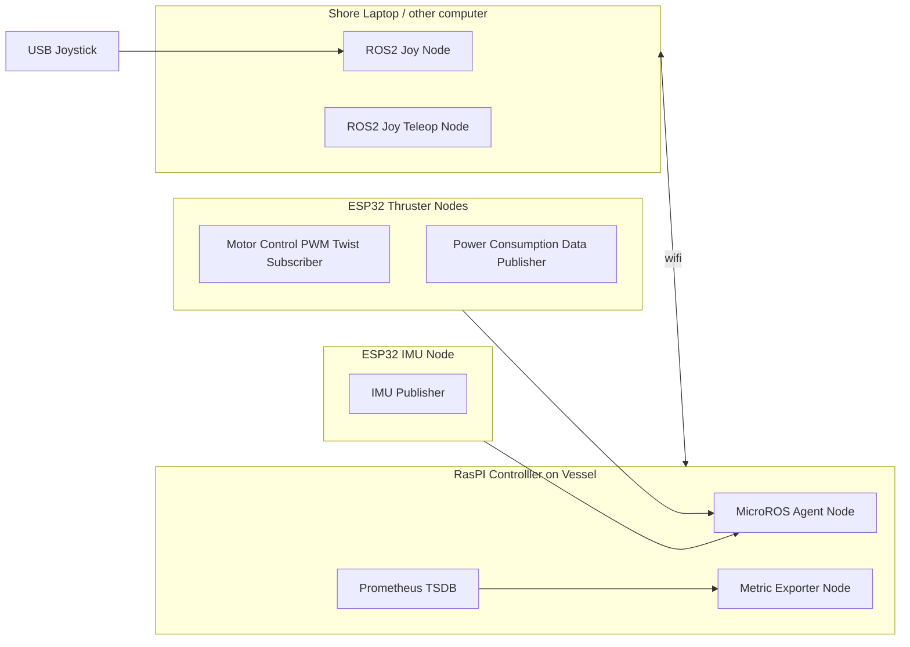

# MiniSub Architecture

## Local setup (test rig)

Local is easiest to use when testing locally as it only requires a single computer, and communicates with the vehicle over the ESP32's WiFi directly.

## Remote setup (MicroSub)

The Remote setup is more robust and intended to allow the vehicle to perform autonomously while providing various methods to connect to the vehicle over long distances.

