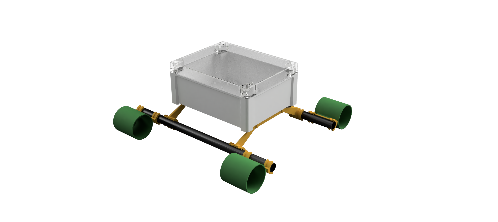
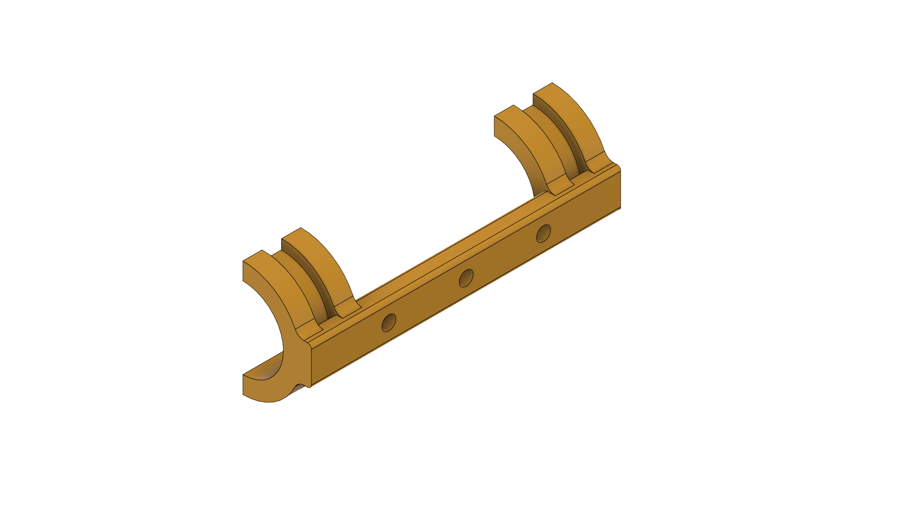
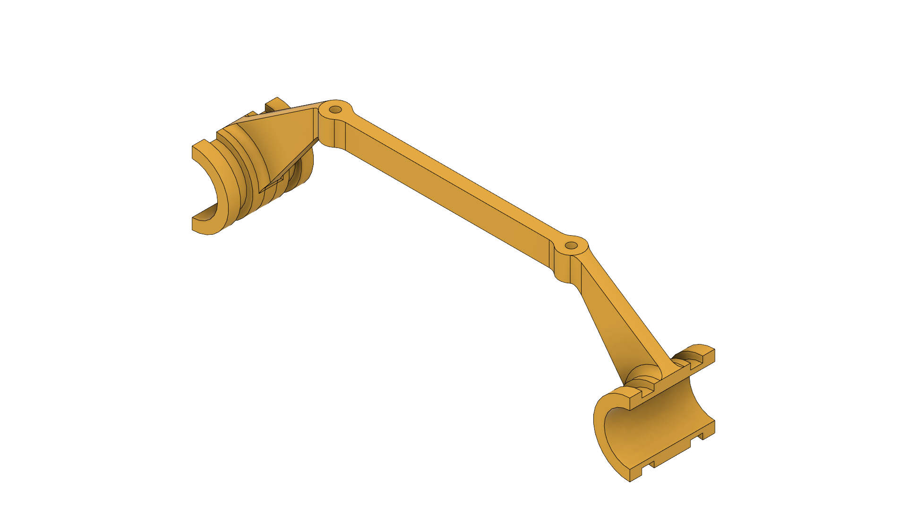

# MicroSub

MicroSub is the successor of TestRig, aiming to be be more hydrodynamically streamlined, rather than just pushing a square box through the water. It consists of several carbon fiber tubes, which are held together using 3D printed brackets. Custom mounting brackets are used to attach various peripherals and electronics housings to the carbon frame. This provides a flexible base to develop future components upon. 

## Bill of Materials

Please see [this Google Sheet](https://docs.google.com/spreadsheets/d/1FYi1ho1pSlrZq92Os0Z4knA6lPX_ejX5wQUlka7eo4U/edit?usp=sharing) for the materials currently used to build Test Rig and at a later stage the actual MiniSub Vehicle.

## Custom Components

Components are attached to the FC tubes using 3D printed mounting brackets. They wrap halfway around the tubes and are secured in place using zip tie cable wrappers, which fit into designated slots. 

### Thruster Mounts

As the name implies, the thruster mounts are responsible for mounting thrusters to the carbon fiber tubing the frame is made up of. 

### Box Mounts

The box mounts are used to mount the electronics boxes to the CF tubing.

