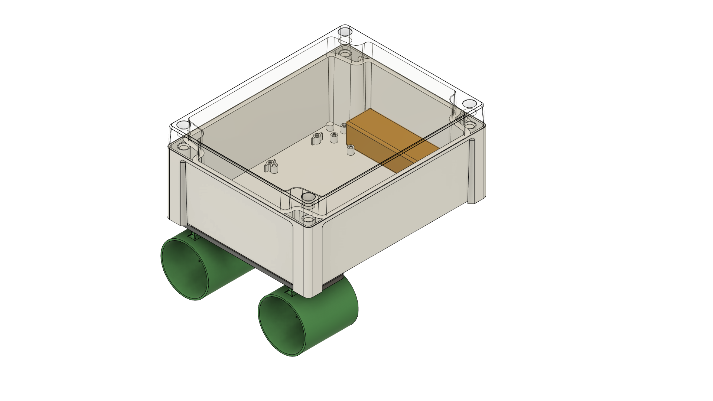
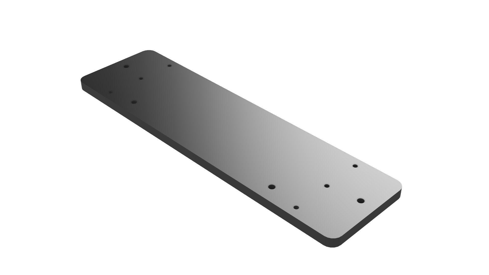

# Test Rig

Current development is done on a very bare-bones test rig, basically consisting of a watertight box with 2 thruster mounted to the bottom. The Test Rig is not meant to be submersible, instead it floats around the surface, to test control mechanics and electronics.

## Bill of Materials

Please see [this Google Sheet](https://docs.google.com/spreadsheets/d/1FYi1ho1pSlrZq92Os0Z4knA6lPX_ejX5wQUlka7eo4U/edit?usp=sharing) for the materials currently used to build Test Rig and at a later stage the actual MiniSub Vehicle.

## Custom Components

### 3D Printed Motor Mount

!!! Note
    This motor mount has some serious design issues and probably shouldn't be used as-is.

A 3D printed motor mount is used to attach the thrusters to the electronics housing. STEP and STL files are provided [here](https://github.com/JeffreyDD/minisub/tree/main/design/TestRig).

